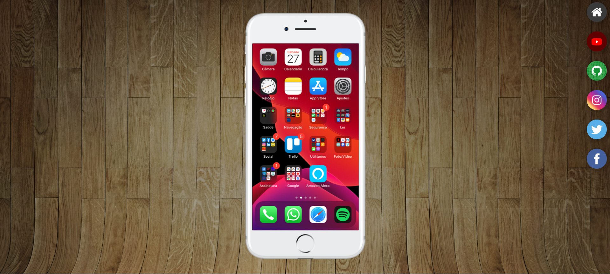

# 🎬 Projeto Mídia - HTML5 com Vídeo, Imagem e Áudio

Este é um projeto básico feito com **HTML5**, onde são apresentados elementos de mídia como **vídeo**, **imagem** e **áudio** em uma página simples e responsiva.

Foi desenvolvido durante o curso do **Professor Gustavo Guanabara** no [Curso em Vídeo](https://www.cursoemvideo.com/), como parte do aprendizado inicial de desenvolvimento web.

---

## 📺 Sobre o projeto

A proposta do projeto é treinar a inserção de diferentes tipos de mídia em uma página HTML:

- 🎥 Um vídeo local
- 🖼️ Uma imagem
- 🎧 Um arquivo de áudio

Tudo estruturado com semântica HTML e formatação básica.

---

## 🛠 Tecnologias utilizadas

| Tecnologia | Descrição                          |
|------------|--------------------------------------|
| 🌐 HTML5   | Estrutura da página                 |
| 📷 Mídia   | Arquivos de vídeo, imagem e áudio   |

> Este projeto **não utiliza JavaScript nem CSS externo**, focando na base do HTML puro.

## Demonstração

---

## 🚀 Como executar

### ✔️ Pré-requisitos

- Um navegador web moderno (Chrome, Firefox, Edge, etc)

### ▶️ Passos

1. Clone ou baixe este repositório:

```bash
git clone https://github.com/L1m4z1n/Projeto-Midia.git
cd Projeto-Midia
